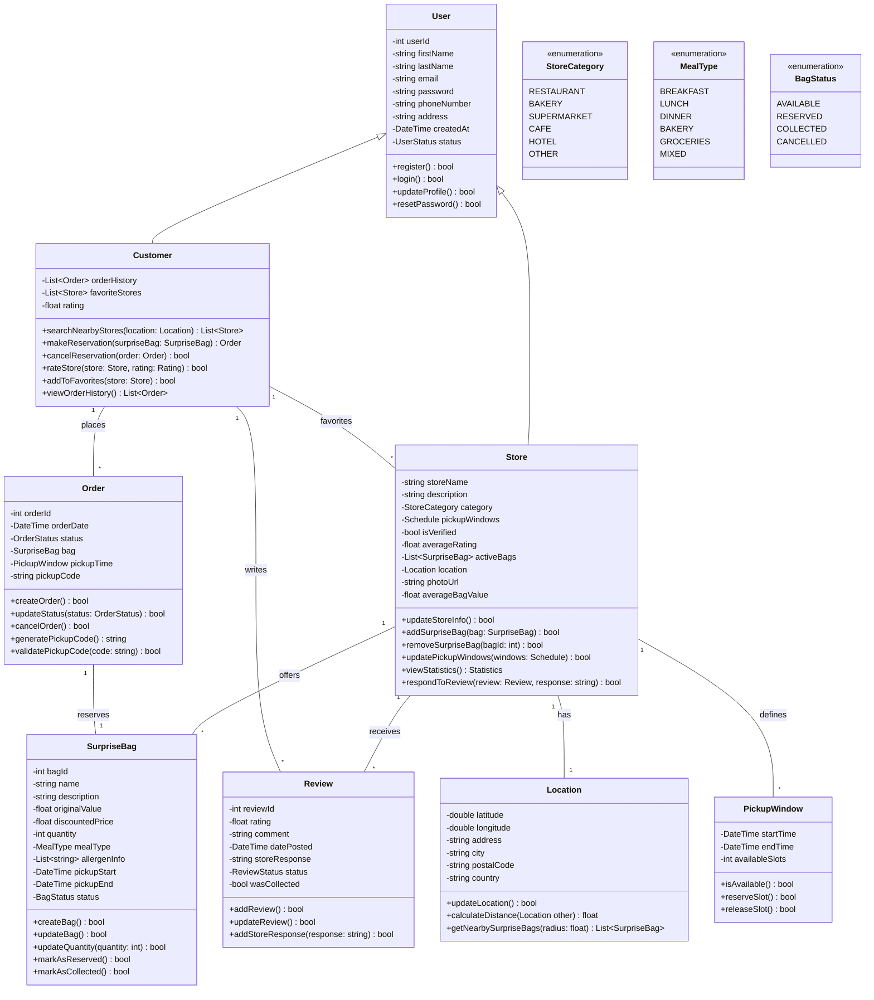
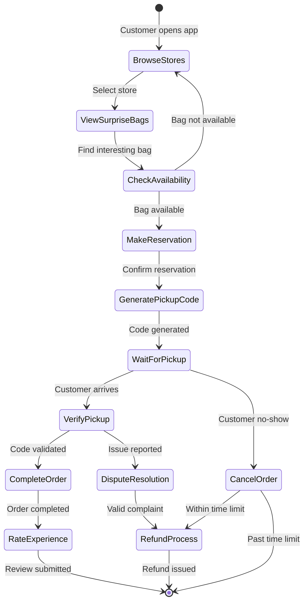
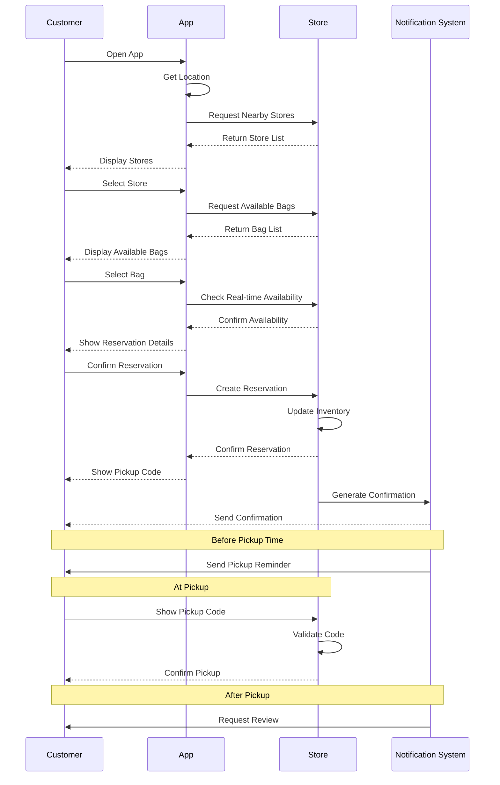
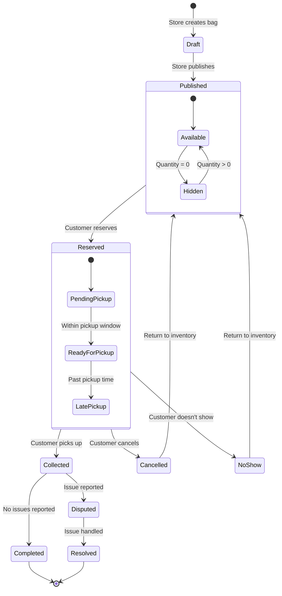

This app connects users with restaurants and stores that offer surplus food at a discount, making it easy for consumers to access quality food affordably while reducing food waste in Tunisia.

# App Main Features

- User Authentication
- User Profile Management
- Store Management
- Store Search and Discovery
- Surprise Bag Management
- Order and Reservation
- Review and Rating
- Analytics and Reporting
- System Administration

# Main Class Diagram

# Activity Diagram for the order process

# Sequence Diagram for the reservation process

# State Diagram for the surprise bag lifecycle

